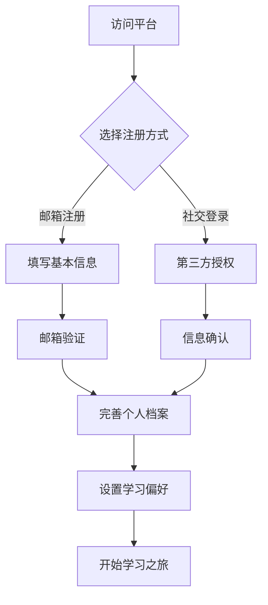

# 🌳 PraxisGrove

<div align="center">


**重新定义在线教育 - AI驱动的沉浸式学习平台**

*融合人工智能、3D可视化与社区协作，打造无边界的知识探索体验*

[](https://nextjs.org/)
[](https://www.typescriptlang.org/)
[](https://tailwindcss.com/)
[](https://threejs.org/)

[🚀 立即体验](https://www.praxisgrove.com) | [📖 产品文档](./docs) | [💬 加入社区](https://github.com/PraxisGrove/website/discussions) | [🐛 反馈问题](https://github.com/PraxisGrove/website/issues)

</div>

## 🎯 产品愿景

PraxisGrove 致力于构建下一代在线教育生态系统，通过前沿技术与教育理念的深度融合，让每个人都能享受到个性化、沉浸式的学习体验。我们相信，真正的教育应该是无边界的、智能化的、永续的。

### ✨ 核心价值

- **� 智能驱化学习** - AI助手提供24/7个性化指导，让学习更高效
- **🌐 沉浸式体验** - 3D知识地图让抽象概念变得可视化、可交互
- **🤝 社区驱动** - 连接全球学习者，共建知识生态
- **� 多数据驱动** - 深度学习分析，持续优化学习路径
- **�  开放包容** - 无门槛访问，让优质教育触手可及
- **⚡ 永续记录** - 区块链技术确保学习成果永久可信

## 🚀 产品功能

### 🔐 身份认证与权限管理
- **多元化登录** - 邮箱密码、OAuth社交登录、双因素认证
- **智能档案** - 个性化用户画像，学习偏好自动识别
- **分级权限** - 学习者、创作者、专家、管理员多角色体系
- **安全防护** - 端到端加密，会话管理，隐私保护

### 🎓 学习管理
- **课程系统** - 完整的课程创建、管理和学习功能
- **进度跟踪** - 详细的学习进度和成就系统
- **多媒体支持** - 视频播放、文档阅读、交互式内容
- **个性化推荐** - 基于学习历史的智能推荐

### 🤖 AI智能助手
- **智能问答** - 基于大语言模型的24/7学习助手，支持多轮对话
- **个性化推荐** - 分析学习行为，智能推荐最适合的内容和路径
- **自适应学习** - 根据掌握程度动态调整难度和节奏
- **多模态交互** - 支持文字、语音、图像等多种交互方式
- **专业领域** - 涵盖编程、数学、科学、语言等多个学科领域

### 🌐 3D知识宇宙
- **立体知识图谱** - 将抽象知识转化为可探索的3D空间
- **沉浸式导航** - 自由飞行、缩放、旋转，如同探索宇宙
- **智能关联** - 动态展示概念间的依赖关系和相似度
- **学习轨迹** - 可视化个人学习历程和成长路径
- **协作空间** - 多人同时探索，实时分享发现和见解

### 👥 学习社区
- **智能匹配** - 基于兴趣和水平匹配学习伙伴
- **知识市场** - 用户创作内容的分享与交易平台
- **专家网络** - 连接行业专家，提供权威指导
- **学习圈子** - 围绕特定主题建立深度学习社群
- **成就系统** - 游戏化激励机制，让学习更有趣

### 🌍 国际化支持
- **多语言切换** - 中文/英文无缝切换
- **本地化格式** - 日期、数字、时间格式化
- **响应式语言选择器** - 桌面和移动端适配
- **智能语言检测** - 自动检测用户首选语言

### 🎨 现代化设计
- **深色/浅色主题** - 完整的主题切换系统
- **响应式布局** - 完美适配所有设备尺寸
- **流畅动画** - 精心设计的过渡效果
- **无障碍支持** - 符合WCAG标准的可访问性

## 🔐 身份认证系统

### 🚪 多样化登录方式

| 登录类型 | 支持平台 | 特色功能 |
|---------|---------|---------|
| 📧 邮箱登录 | 通用邮箱 | 密码强度检测、找回密码 |
| 🔗 社交登录 | Google、GitHub、微信、支付宝 | 一键授权、信息同步 |
| 🔒 安全登录 | TOTP、SMS | 双因素认证、生物识别 |
| 🎓 教育登录 | 学校邮箱、教育机构 | 身份验证、批量管理 |

### 👥 用户角色体系

```
🔧 管理员   ├─ 系统配置、用户管理、内容审核
👨‍🎓 用户     ├─ 课程学习、内容创作、社区参与
👤 访客     └─ 浏览内容、试用功能
```

### � 注册加与认证流程



### 🛡️ 安全防护机制

- **🔐 数据加密** - bcrypt密码哈希 + AES-256数据加密
- **🎫 会话管理** - JWT令牌 + Redis会话存储
- **🛡️ 攻击防护** - CSRF保护 + XSS过滤 + SQL注入防护
- **⏰ 智能监控** - 异常登录检测 + 自动会话过期
- **🔍 审计日志** - 完整的用户行为记录与分析
- **🌐 隐私保护** - GDPR合规 + 数据最小化原则

## 🛠️ 技术架构

### 🎨 前端技术栈
```
🏗️ 核心框架   Next.js 15 (App Router) + TypeScript 5.0 + React 18
🎨 样式方案   Tailwind CSS 4.0 + shadcn/ui + Radix UI + CSS Modules
🌐 3D渲染    Three.js + React Three Fiber + Drei + React Three Rapier
📊 状态管理   Zustand + TanStack Query + Jotai + React Context
🔐 认证系统   NextAuth.js v5 + JWT + OAuth 2.0 + Clerk (可选)
📝 表单处理   React Hook Form + Zod + TypeScript + React Select
🎭 动画效果   Framer Motion + Lottie React + CSS Transitions
🌍 国际化    next-intl + React Intl + ICU MessageFormat
📱 移动适配   PWA + Responsive Design + Touch Gestures
🔍 搜索功能   Algolia + Fuse.js + React InstantSearch
📊 图表可视化 Recharts + D3.js + Observable Plot
🎵 多媒体    React Player + Web Audio API + MediaRecorder
```

### ⚡ 性能优化
- **代码分割** - 基于路由和组件的自动代码分割
- **图像优化** - Next.js Image 组件 + WebP/AVIF 格式 + 响应式图片
- **缓存策略** - SWR + React Query + Service Worker + CDN缓存
- **懒加载** - React.lazy + Intersection Observer + 虚拟滚动
- **预加载** - Link prefetch + Resource hints + Critical CSS
- **Bundle优化** - Tree shaking + Code splitting + Dynamic imports
- **渲染优化** - SSR + SSG + ISR + Streaming + React Suspense

### 🔧 开发工具链
```
📦 包管理器   pnpm + Workspace + Volta (Node版本管理)
🔍 代码质量   ESLint + Prettier + Stylelint + Husky + lint-staged
🧪 测试框架   Vitest + Testing Library + Playwright + Storybook
⚡ 构建工具   Turbopack + SWC + PostCSS + Autoprefixer
🚀 部署平台   Vercel + GitHub Actions + Docker + Nginx
📊 监控分析   Vercel Analytics + Sentry + Lighthouse CI
🔧 开发体验   VS Code + TypeScript + Tailwind IntelliSense
```


## 🤝 参与贡献

我们欢迎所有形式的贡献！无论是代码、设计、文档还是想法。

### 贡献方式
- 🐛 [报告 Bug](https://github.com/PraxisGrove/website/issues/new?template=bug_report.md)
- 💡 [提出功能建议](https://github.com/PraxisGrove/website/issues/new?template=feature_request.md)
- 📝 [改进文档](https://github.com/PraxisGrove/website/tree/main/docs)
- 🔧 [提交代码](https://github.com/PraxisGrove/website/pulls)

### 开发规范
- 遵循 [代码规范](./docs/CODING_STANDARDS.md)
- 提交前运行 `yarn lint` 和 `yarn test`
- 使用 [约定式提交](https://www.conventionalcommits.org/zh-hans/)

## 🏆 致谢与支持

感谢所有为 PraxisGrove 项目做出贡献的开发者、设计师和教育工作者。

### 开源致谢
- [Next.js](https://nextjs.org/) - 强大的 React 全栈框架
- [Three.js](https://threejs.org/) - 卓越的 3D 图形库
- [Tailwind CSS](https://tailwindcss.com/) - 高效的 CSS 框架
- [shadcn/ui](https://ui.shadcn.com/) - 优雅的组件库

## 📞 联系我们

<div align="center">

| 渠道 | 链接 | 描述 |
|------|------|------|
| 🌐 官网 | [praxisgrove.com](https://www.praxisgrove.com) | 产品体验与最新资讯 |
| 📧 邮箱 | [contact@praxisgrove.com](mailto:contact@praxisgrove.com) | 商务合作与技术支持 |
| 💬 社区 | [GitHub Discussions](https://github.com/PraxisGrove/website/discussions) | 用户交流与问题讨论 |
| 🐙 GitHub | [@PraxisGrove](https://github.com/PraxisGrove) | 开源代码与项目管理 |
| 🐦 Twitter | [@PraxisGrove](https://twitter.com/PraxisGrove) | 产品动态与行业洞察 |

</div>


## 📄 许可证

本项目采用 [Apache License 2.0](LICENSE) 许可证。

```
Copyright 2025 PraxisGrove

Licensed under the Apache License, Version 2.0 (the "License");
you may not use this file except in compliance with the License.
You may obtain a copy of the License at

    http://www.apache.org/licenses/LICENSE-2.0

Unless required by applicable law or agreed to in writing, software
distributed under the License is distributed on an "AS IS" BASIS,
WITHOUT WARRANTIES OR CONDITIONS OF ANY KIND, either express or implied.
See the License for the specific language governing permissions and
limitations under the License.
```

---

<div align="center">

**🌟 如果这个项目对你有帮助，请给我们一个 Star！**

Made with ❤️ by the PraxisGrove Team

</div>
