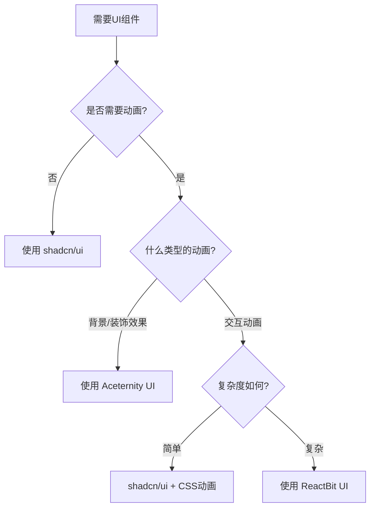

# 组件库最佳实践指南

## 🎯 核心原则

### 1. 组件选择优先级

```
基础功能 → shadcn/ui → 可访问性优先
视觉效果 → Aceternity UI → 现代化动画
特殊交互 → ReactBit UI → 精确控制
```

### 2. 性能优先原则

- ✅ 优先使用静态组件
- ✅ 按需添加动画效果
- ✅ 遵循用户偏好设置
- ✅ 在低性能设备上降级

### 3. 可访问性原则

- ✅ 保持键盘导航支持
- ✅ 提供适当的 ARIA 标签
- ✅ 支持屏幕阅读器
- ✅ 遵循 WCAG 指南

## 📋 组件使用决策树



## 🛠️ 实践指南

### 1. 表单组件

```tsx
// ✅ 推荐：基础表单使用 shadcn/ui
import { Button, Input, Label, Card } from '@/components/unified';

function LoginForm() {
  return (
    <Card className="p-6">
      <div className="space-y-4">
        <div>
          <Label htmlFor="email">邮箱</Label>
          <Input id="email" type="email" />
        </div>
        <Button type="submit">登录</Button>
      </div>
    </Card>
  );
}

// ✅ 需要动画时的增强版本
import {
  Button,
  Input,
  Label,
  GlassCard,
  AnimatedContainer,
  ReactBitInput,
} from '@/components/unified';

function EnhancedLoginForm() {
  return (
    <AnimatedContainer animation="slideUp">
      <GlassCard className="p-6">
        <div className="space-y-4">
          <div>
            <Label htmlFor="email">邮箱</Label>
            <ReactBitInput
              id="email"
              type="email"
              animation="glow"
              variant="outlined"
            />
          </div>
          <Button type="submit">登录</Button>
        </div>
      </GlassCard>
    </AnimatedContainer>
  );
}
```

### 2. 按钮组件

```tsx
// ✅ 基础按钮使用场景
import { Button } from '@/components/unified';

// 表单提交、导航等基础交互
<Button variant="default">提交</Button>
<Button variant="outline">取消</Button>

// ✅ 需要视觉吸引力时
import { Button, PulseGlow } from '@/components/unified';

<Button>
  <PulseGlow>
    重要操作
  </PulseGlow>
</Button>

// ✅ 需要特殊交互效果时
import { ReactBitButton } from '@/components/unified';

<ReactBitButton animation="ripple" variant="default">
  涟漪效果按钮
</ReactBitButton>
```

### 3. 卡片组件

```tsx
// ✅ 内容展示卡片
import { Card, CardHeader, CardTitle, CardContent } from '@/components/unified';

<Card>
  <CardHeader>
    <CardTitle>标题</CardTitle>
  </CardHeader>
  <CardContent>内容</CardContent>
</Card>;

// ✅ 需要视觉效果的卡片
import { GlassCard, AnimatedContainer } from '@/components/unified';

<AnimatedContainer animation="fadeIn">
  <GlassCard className="p-6">玻璃效果卡片</GlassCard>
</AnimatedContainer>;

// ✅ 需要交互动画的卡片
import { ReactBitCard } from '@/components/unified';

<ReactBitCard variant="elevated" animation="tilt" interactive={true}>
  3D 交互卡片
</ReactBitCard>;
```

### 4. 文本组件

```tsx
// ✅ 普通文本
<p className="text-muted-foreground">普通文本内容</p>;

// ✅ 强调文本
import { GradientText } from '@/components/unified';

<GradientText className="text-2xl font-bold">渐变标题</GradientText>;

// ✅ 动画文本
import { ReactBitText } from '@/components/unified';

<ReactBitText variant="typewriter" speed={100}>
  打字机效果文本
</ReactBitText>;
```

## 🎨 主题和样式

### 1. 主题一致性

```tsx
// ✅ 使用统一的主题系统
import { useAceternityTheme } from '@/components/unified';

function ThemedComponent() {
  const { theme } = useAceternityTheme();

  return <div style={{ color: theme.colors.primary }}>主题化内容</div>;
}
```

### 2. 响应式设计

```tsx
// ✅ 响应式组件布局
<div className="grid grid-cols-1 gap-4 md:grid-cols-2 lg:grid-cols-3">
  {items.map((item) => (
    <Card key={item.id} className="p-4">
      {item.content}
    </Card>
  ))}
</div>
```

### 3. 暗色模式支持

```tsx
// ✅ 自动适配暗色模式
<Card className="bg-background border-border">
  <CardContent className="text-foreground">自动适配暗色模式的内容</CardContent>
</Card>
```

## ⚡ 性能优化

### 1. 条件渲染动画

```tsx
import { reactBitUtils } from '@/components/unified';

function PerformanceOptimizedComponent() {
  const shouldAnimate = reactBitUtils.shouldAnimate();

  return shouldAnimate ? (
    <ReactBitCard animation="float">动画版本</ReactBitCard>
  ) : (
    <Card>静态版本</Card>
  );
}
```

### 2. 懒加载重型组件

```tsx
import { lazy, Suspense } from 'react';
import { LoadingSpinner } from '@/components/unified';

const HeavyAnimationComponent = lazy(
  () => import('@/components/heavy-animation')
);

function LazyLoadedComponent() {
  return (
    <Suspense fallback={<LoadingSpinner />}>
      <HeavyAnimationComponent />
    </Suspense>
  );
}
```

### 3. 动画性能监控

```tsx
import { reactBitUtils } from '@/components/unified';

// 根据设备性能调整动画
const devicePerformance = reactBitUtils.performance.getDevicePerformance();

const animationConfig = {
  low: { duration: 0.2, complexity: 'simple' },
  medium: { duration: 0.3, complexity: 'moderate' },
  high: { duration: 0.5, complexity: 'complex' },
};

const config = animationConfig[devicePerformance];
```

## 🧪 测试策略

### 1. 组件测试

```tsx
import { render, screen } from '@testing-library/react';
import { Button } from '@/components/unified';

test('按钮渲染正确', () => {
  render(<Button>测试按钮</Button>);
  expect(screen.getByRole('button')).toHaveTextContent('测试按钮');
});
```

### 2. 动画测试

```tsx
import { render } from '@testing-library/react';
import { ReactBitButton } from '@/components/unified';

test('动画按钮在禁用动画时正常工作', () => {
  // 模拟禁用动画环境
  Object.defineProperty(window, 'matchMedia', {
    writable: true,
    value: jest.fn().mockImplementation((query) => ({
      matches: query === '(prefers-reduced-motion: reduce)',
      media: query,
      onchange: null,
      addListener: jest.fn(),
      removeListener: jest.fn(),
    })),
  });

  const { container } = render(
    <ReactBitButton animation="ripple">测试按钮</ReactBitButton>
  );

  expect(container.firstChild).toBeInTheDocument();
});
```

### 3. 可访问性测试

```tsx
import { render } from '@testing-library/react';
import { axe, toHaveNoViolations } from 'jest-axe';

expect.extend(toHaveNoViolations);

test('组件无可访问性问题', async () => {
  const { container } = render(<Button>测试按钮</Button>);
  const results = await axe(container);
  expect(results).toHaveNoViolations();
});
```

## 🚫 常见错误和解决方案

### 1. 过度使用动画

```tsx
// ❌ 错误：所有组件都使用动画
function BadExample() {
  return (
    <div>
      <ReactBitButton animation="ripple">按钮1</ReactBitButton>
      <ReactBitButton animation="glow">按钮2</ReactBitButton>
      <ReactBitButton animation="magnetic">按钮3</ReactBitButton>
    </div>
  );
}

// ✅ 正确：适度使用动画
function GoodExample() {
  return (
    <div>
      <Button variant="outline">取消</Button>
      <Button variant="default">确认</Button>
      <ReactBitButton animation="ripple">主要操作</ReactBitButton>
    </div>
  );
}
```

### 2. 忽略可访问性

```tsx
// ❌ 错误：只关注视觉效果
<ReactBitButton animation="magnetic">
  <GradientText>按钮</GradientText>
</ReactBitButton>

// ✅ 正确：保持可访问性
<ReactBitButton
  animation="magnetic"
  aria-label="执行主要操作"
>
  <GradientText>按钮</GradientText>
</ReactBitButton>
```

### 3. 性能问题

```tsx
// ❌ 错误：在列表中使用复杂动画
{
  items.map((item) => (
    <ReactBitCard key={item.id} animation="tilt">
      {item.content}
    </ReactBitCard>
  ));
}

// ✅ 正确：列表使用简单动画
{
  items.map((item) => (
    <AnimatedContainer key={item.id} animation="fadeIn">
      <Card>{item.content}</Card>
    </AnimatedContainer>
  ));
}
```

## 📚 参考资源

- [shadcn/ui 文档](https://ui.shadcn.com/)
- [Framer Motion 性能指南](https://www.framer.com/motion/guide-reduce-bundle-size/)
- [Web 可访问性指南](https://www.w3.org/WAI/WCAG21/quickref/)
- [React 性能优化](https://react.dev/learn/render-and-commit)

## 🔄 更新和维护

### 定期检查清单

- [ ] 检查组件库版本更新
- [ ] 运行性能基准测试
- [ ] 验证可访问性合规性
- [ ] 更新文档和示例
- [ ] 检查浏览器兼容性

### 监控指标

- 组件渲染性能
- 动画流畅度 (FPS)
- 包大小影响
- 可访问性评分
- 用户体验指标
